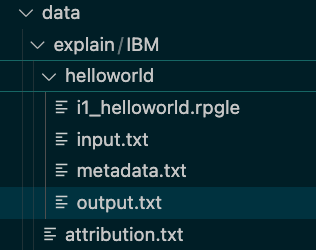
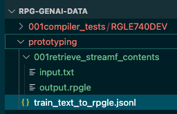

# How to contribute to training the new RPG Generative AI

## RPG Code

The easiest way to contribute to training data to train the new RPG Code Assistant is through contributing code.

There is a private enterprise github repository only visible to IBMers involved in this project to store this source.
Please send a zip or savf to <AIforIBMi@ibm.com> to contribute.  The zip directory should have an `attribution.txt` file will will let us know who has contributed the source.  For example:

```yaml
title : ILE RPG Compiler Test Cases
link : https://github.com/edmundreinhardt/rpg-genai-data/tree/main/src/001compiler_tests/
creator : Barbara Morris
license : Apache 2.0
organization : IBM
version : https://github.com/edmundreinhardt/rpg-genai-data/commit/d41c5d45a58653d7d12958be6c2b739cb5d7e902
```

If you generously want to let anyone contribute to this project, it can be [pull requested](https://docs.github.com/en/pull-requests/collaborating-with-pull-requests/proposing-changes-to-your-work-with-pull-requests/creating-a-pull-request) to the repository, <https://github.com/AIforIBMi/rpg-genai-data>.  You would first have to added to the contributors by emailing <AIforIBMi@ibm.com>
Please make sure that you do not PR <https://github.com/IBM/rpg-genai-data> which is a public repo.

There is also an enterprise repository which only IBMers can see if you do not want anyone else browsing your code. It still is conceivable that the AI might offer snippets of your code in response to specific prompts.  If you are willing to share your code under these conditions, please send your code to <AIforIBMi@ibm.com>

If you have an existing public repository with a permissive license, list it in the file:
<https://github.com/AIforIBMi/rpg-genai-data/blob/main/src/repos_for_training.md>

## Training Data

Unfortunately we are unable to use plain RPG source to finetune the AI directly. We hope to be able to use plain source in later stages.

What would be most useful therefore is to contribute question and answer pairs.

The format used to train the AI is JSONL.  This is the file format where each line is a separate JSON with the format:

```json
{"id": "<UNIQUE_ID>", "input":”<QUESTION>”, "context":"<CONTEXT>", ”output”:”<ANSWER>”, "task":"<TASK>", "difficulty" : "<DIFFICULTY>"}
```

Where
<dl>
<dt>UNIQUE_ID</dt>
<dd>unique alphanumeric string with no blanks<dd>
<dt>QUESTION</dt>
<dd>the request being made to the LLM</dd>
<dt>CONTEXT</dt>
<dd>files and definitions that the question is dependent on</dd>
<dt>ANSWER</dt>
<dd>the response that the LLM *should* provide</dd>
<dt>TASK_TYPE</dt>
<dd>What type of task is being attempted: explain/prototyping/fixed-to-free</dd>
<dt>DIFFICULTY</dt>
<dd>Difficulty of question on a scale from 0 to 5 where 5 is the most difficult and 0 is trival</dd>
</dl>

These JSONL files will be found in the [AIforIBMi repo](https://github.com/AIforIBMi/rpg-genai-data) under
```/data/<task_name>/<your_directory>```.
Please add to this directory a file `attribution.txt` with content of the form:

```yaml
title : ILE RPG Compiler Test Cases
link : https://github.com/edmundreinhardt/rpg-genai-data/tree/main/src/001compiler_tests/
creator : Barbara Morris
license : Apache 2.0
organization : IBM
version : https://github.com/edmundreinhardt/rpg-genai-data/commit/d41c5d45a58653d7d12958be6c2b739cb5d7e902
```

Since RPG source in `jsonl` will be difficult to read as it all has to be on one line, we have an easier format to submit your training data.  Use the following data structure:

- data/
  - <task_name>/
    - <your_org>/
      - any_id1
        - input.txt
        - i1_file1.rpgle
        - c1_MYDSPF.DSPF
        - c2_MYTABLE.TABLE
        - output.txt
        - o1_somefile.rpgle
        - metadata.txt

The above directory structure will automatically be transformed by IBM into a `jsonl` line of the form:

```json
{"id": "any_id1", "input":”<input.txt contents>\n\nfile1.rpgle\n<i1_file1.rpgle contents>”, "context”: "MYDSPF.DSPF<c1_MYDSPF.DSPF contents>\n\nMYTABLE.TABLE\n<i3_MYTABLE.TABLE contents>", ”output”: ”<output.txt contents>\n\nsomefile.rpgle\no1_somefile.rpgle contents”, "task":"<task_name>", "difficulty":0}
```

Note that the `i<number>_` prefix is used to impose an order in which the input files show up in the question.  The `c<number>_` prefix similarly orders the files that are needed to give the context for the question. Finally the `o<number>_` prefix similarly orders the output files that are embedded in the answer.  The `output.txt` could also be `output.rpgle` if the output only contains code.  The `metadata.txt` in this case contains the difficulty level.

```yaml
 difficulty: 0
```

### Use cases and examples

The scenarios we are initially focused on are:

#### 1) EXPLAIN

In this scenario the question is in format of RPG code and the output is an explanation of that code.

Since the task is to explain some RPG, all of the following data is found in the `data/explain` directory.
For this example we will have a training pair submitted by IBM, so the data will be in the `data/explain/IBM` directory.


The main file used to do the training is `train_text_to_rpgle.jsonl`

```json
{"file_id": "helloworld", "input":"Explain the following ILE RPG code\n\nhelloworld.rpgle\n**free;\ndsply ‘hello world’;\n
return;\n","output":"The fully free-form ILE RPG program displays the message ‘hello world’ to the user."}
```

If you used the directory method it would look like

- helloworld\
  - input.txt
  - i1_helloworld.rpgle
  - output.txt
  - metatdata.txt

where input.txt has the content:

```text
Explain the following ILE RPG code
```

and `i1_helloworld.rpgle` has the content:

```rpgle
**free
dsply 'hello world';
return;
```

and output.txt has the content:

```text
The fully free-form ILE RPG program displays the message 'hello world' to the user.
```

and `metadata.txt` has

```yaml
difficulty: 0
```

#### 2. Generate RPGLE

In this scenario the question is in format of text requesting the generation of new RPG code and the output is the generated RPG.

All of the following data is found in the `prototyping` directory.


