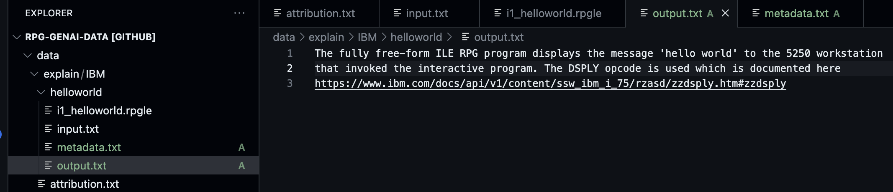

# How to contribute to IBM's repository of data

1. Make sure you have a github id
2. Fork the IBM repository
3. Create a branch
4. Make your contribution in this branch in your repository
5. Create a `pull request` to contribute your change to the IBM repository

## Overview

The diagram below outlines the one time setup required to setup a forked repository on your local machine:


The diagram below outlines the process of contributing training data as well as the typical branch workflow that should be followed:


## Make sure you have a `GitHub` id

If you already have a `GitHub`id you can skip this step.
Any git account will do.  Here is some instructions if you have never created a git id before. <https://www.wikihow.com/Create-an-Account-on-GitHub>

## Make sure your `GitHub` id has access to the IBM repo

You would first have to added to the contributors by emailing <AIforIBMi@ibm.com>.  Explain what you would like to contribute to the training data to justify being given this access.  Wait for IBM to provide access before going to the next step.

## Fork the IBM repo

1. Sign in with your GitHub id
2. Go to the IBM Repo <https://github.com/AIforIBMi/rpg-genai-data>
3. Fork the repository, clicking on `Fork` and then `Create a new fork`

Press `Create Fork` button

Now a copy of the repository will exist under your personal GitHub id.  In the example here that is `edmundreinhardt`

## Create a branch

1. You will be taken to the new forked repository at <http://github.com/edmundreinhardt/rpg-genai-data> where *edmundreinhardt* is your github id
2. Click on `main` branch combo box and type in your new branch name.  No blanks are allowed.  In my case I am adding a Hello World explain task, so I called it `add_hello_world`

Then press the `Create branch *branch_name* button.

More documnentation can be found [here](https://docs.github.com/en/pull-requests/collaborating-with-pull-requests/proposing-changes-to-your-work-with-pull-requests/creating-and-deleting-branches-within-your-repository)

## Make your changes

There are many ways to make your change. 
For example you could git clone to your PC and make the change there using RDi or VS Code for tools or even just the PC command line.
We are going to make the change the simplest way, right in the browser.

1. We are now siting in github with the new branch selected


2. Press the '.' key to launch into VS Code on the web
3. In the `data` folder, go to your organization's folder.

- If it doesn't exist create it.  In my case I am creating one for `IBM`.  
  - First select `New Folder...` from the `data` folder context menu
      
  - Name the folder after you or your organization

      
  - Add an `attibution.txt` file to specify who is contributing this with permission
    - Create a `New File ...` in your organization dir and name it [`attribution.txt`](attribution.md)
        
    - Fill in the details of your organization, contact and permission. If this is coming from a repo, feel free to provide a link.

```yaml
title : IBM supplied examples of RPG and their explanation
contact : Edmund Reinhardt
email : edmund.reinhardt@ca.ibm.com
license : Apache 2.0
organization : IBM
```

- Within your organization folder create a folder for the particular task you are creating.  The name of the task should be unique as it becomes the identifier for this task.
In our scenario we call the task `helloworld`.  If there is a name collision, IBM will append a UUID.


- within the task folder, create a file `input.txt` with the question you are asking the AI.  In our case this is asking to expaling the RPG.

- If necessary, supply the RPG referenced in the question in files beginning with `i1_`.  In our case we create `i1_helloworld.rpgle` with the RPG source to be explained.

- supply any required files for context with prefix `cn_` where `n` is a unique number to order the files. In our case there is no context required.
- supply the expected answer to the question in `output.txt` or if the output is pure source, `output.rpgle`.  In our case the `output.txt` contains the explanation of the RPG.

- assign a difficulty from 0 to 5 of this task in `yaml` format in the file `metadata.txt` in the same directory.


## Commit your changes to git

1. Switch to Git view


2. Stage all relevant changes to be a part of this commit


3. Put in a message that describes this set of changes and press `Commit & Push`


## Create a Pull Request to contribute your changes back

1. Go to your fork URL - in my case <https://github.com/edmundreinhardt/rpg-genai-data>


2. Since you just pushed a commit on a new branch to this report there will be banner inviting you to `Compare & pull request` your branch.  Press that button.
3. Add `AIforIBMi` as a reviewer


4. Fill in a description that explains what this particular task is training the AI to do and press the `Create pull request` button


5. Congratulations, you did it!.

For more documentation on creating pull requests see <https://docs.github.com/en/pull-requests/collaborating-with-pull-requests/proposing-changes-to-your-work-with-pull-requests/creating-a-pull-request>

## Respond to pull request comments

As IBM is reviewing your pull request, they might have some suggestions on how to improve it.  You will get an email notification of the requested change.


Click on the link will take you to your pull request where you will see the comment.  The `view reviewed changes` link will take you to the context of the comment.


Go back your own repository github page (in my case <https://github.com/edmundreinhardt/rpg-genai-data> and make sure that the branch with your changes on it is seleted.

Press . to open it in gihub.dev (nless you still have the tab open from making the changes.  Opening github.dev is a little expensive, you would prefer to work with you existing tab).
Make the suggested change.

Commit and push the changes from the Git view


This will let IBM reevaluate and merge your change for all the world to benefit from.
