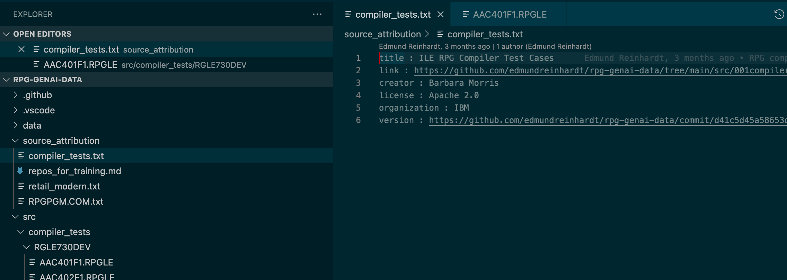

# Contribute RPG Code

The easiest way to contribute to training data to train the new RPG Code Assistant is through contributing code.

## Only IBM has access

There is a private enterprise github repository only visible to IBMers involved in this project to store this source.
Please send a zip or savf to <AIforIBMi@ibm.com> to contribute.  The zip directory should have an `attribution.txt` file will will let us know who has contributed the source.  For example:

```yaml
title : ILE RPG Compiler Test Cases
link : https://github.com/edmundreinhardt/rpg-genai-data/tree/main/src/001compiler_tests/
creator : Barbara Morris
license : Apache 2.0
organization : IBM
version : https://github.com/edmundreinhardt/rpg-genai-data/commit/d41c5d45a58653d7d12958be6c2b739cb5d7e902
```

## Anyone Who is Contributing Has Access

If you generously want to let anyone contribute to this project,
you can follow the steps outlined in the [pull request section](pull_request.md)

1. Fork the <https://github.com/AIforIBMi/rpg-genai-data> repo and press '.' to edit in `code.dev` workspace
2. Under the `src` directory, create a directory for your organization
3. Add an `attribution.txt` file as described under the previous section
4. Copy in all of your code



5. Follow the instructions in the [pull request section](pull_request.md) to commit and create a pull request.

## RPG Code That Is Already Open Source

If you have an existing public repository with a permissive license, list it in the file:
<https://github.com/AIforIBMi/rpg-genai-data/blob/main/src/repos_for_training.md>
Follow the steps outlined in the [pull request section](pull_request.md) and simple update
the `src/repos_for_training.md` file.

## Caveat

Unfortunately we are unable to use plain RPG source to finetune the AI directly at this early point. We hope that after gathering sufficient source we will be able to use plain source in later stages.
