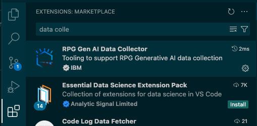
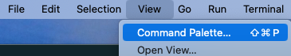
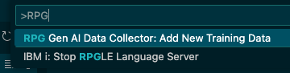
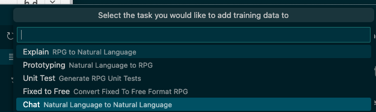
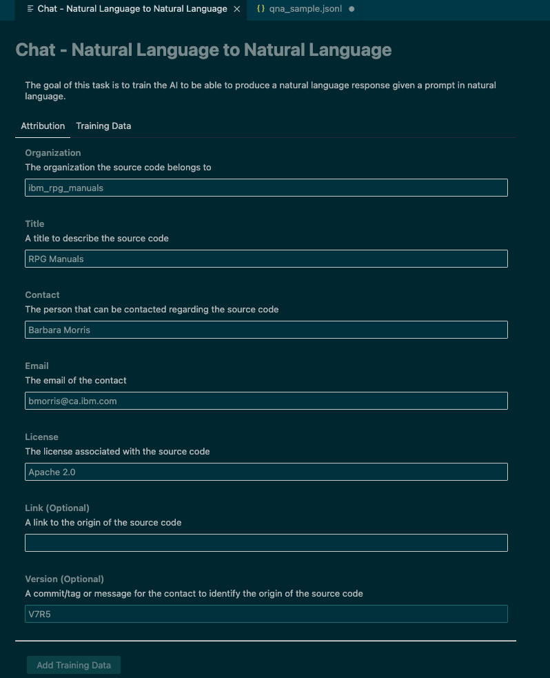
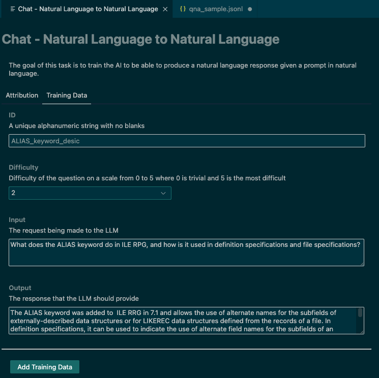
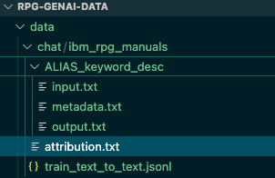

# Ask questions about RPG

We hope to have knowledge from RPG manuals and books available by asking natural language questions from the AI.
To do this we will need to train with question and answer pairs about RPG and CL programming.

## Format

* chat
  * {unique contributor id}
    * attribution.txt
    * {unique test id}
      * input_data.txt - Ask any question about RPG
      * output.txt - Provide good answer to the question
      * metadata.md - difficulty

The `input_data.txt` will have the question you want answered.
The `output.txt` will have the expected answer to this question.
Finally the `metadata.md` documents how difficult you think this question is on scale from 1 to 5.

## Example By "RPG Gen AI Data Collector" UI

1. Make sure you have forked the `https://github.com/AIforIBMi/rpg-genai-data` repository and cloned it to your local PC.
2. Start `VS Code` and make sure you have the `RPG Gen AI Data Collector` extension installed in your local VS Code.

3. Select View->Command Pallette... or C-Shift-P

4. Select `RPG Gen AI Data Collector: Add New Training Data` and hit Enter

5. Pick the task you want to provide training for, in our case `Chat` since we want to do some training on RPG questions and answers.

6. If this is the first task for your organization, you will need to fill the details or your attribution.  Note that the Organization name should avoid blanks as it will also serve as a directory name.

7. Now you should click on the `Training Data` tab and fill that in with a question and answer

8. By pressing the `Add Training Data` button on the bottom all of the files for this question will be generated.

9. Commit the files

10. Go to your github fork and create a pull request

Note that once you have created your organization, you simply select it from the list the next time and fill in the `Training Data` page.
