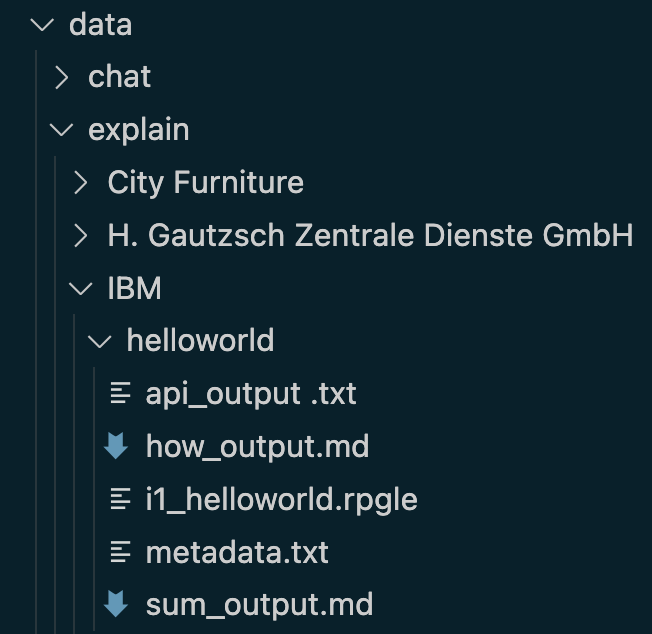

# Explain existing RPG in Natural Language

A common problem for IBM i customers is coming across old code that is not easy to understand. The goal of this task is to train the AI to be able to produce a natural language description of some RPG.
In this scenario the question is in format of RPG code and the output is an explanation of that code.

Since the task is to "explain" some RPG, all of the following data is found in the `data/explain` directory.
For this example we will have a training pair submitted by IBM, so the data will be in the `data/explain/IBM` directory.



The simple directory format would look like

- helloworld\
  - i1_helloworld.rpgle
  - sum_output.md
  - api_output.md
  - how_output.md
  - metatdata.txt

The `i1_helloworld.rpgle` contains the code to be explained.  The `i1_` prefix indicates that it is
the first input:

```rpgle
**free
dsply 'hello world';
return;
```

If there were includes, or file definitions, these can be provided in files prefixed by `cn_` where n is an ordinal integer beginning at 1.  If a procedure or subroutine is being explained, the referenced global definitions and called procedures and subroutines should be included in another `cn_` prefixed RPG source file.

There are three explanations in the form of `<depth>_output.md` where the `<depth>`  is one of:

- sum - business summary in a couple of sentences. i.e. what is the purpose
- api - API level summary - what are the inputs, outputs, side effect of calling this procedure or program, this type of description is not applicable for `line` or `record` scopes (see [scope descriptions](/pages/metadata.md))
- how - details of how the code performs this task

`sum_output.md` has the content:

```text
The fully free-form ILE RPG program displays the message 'hello world'.
```

`api_output.md` has the content:

```text
The fully free-form ILE RPG program displays the message 'hello world' to the 5250 workstation that invoked the interactive program. 
```

`how_output.md` has the content:

```text
The fully free-form ILE RPG program displays the message 'hello world' to the 5250 workstation that invoked the interactive program. 

**free
dsply 'hello world';
return;

The `**free` marks this a fully free ILE RPG program with no column restrictions.
The DSPLY opcode is used which is documented here 
https://www.ibm.com/docs/api/v1/content/ssw_ibm_i_75/rzasd/zzdsply.htm#zzdsply 
The 'hello world' parameter is the message which will be sent.
The `return` opcode ends the program.
```

and `metadata.txt` has

```yaml
difficulty: 0
language: rpg4ff
scope: file
use: train
```

Where

- `difficulty` - the difficulty of the explanation as rated up to 5.  Since this is trivial we rate it as 0.
- `language` - the language of the snippet of code being explained in this case `rpg4ff` which is RPG IV fully free
- `scope` - the scope of the language being explained in this case `file` i.e. the source file
- `use` - `train` means the data is used for training the LLM, the alternative would be `eval` if this was being used to evaluate an LLM

Full description of all the metadata variants can be found [here](/pages/metadata.md).

The main file used to do the training is `train_rpgle_to_text.jsonl` or it your example might be chosen to evaluate the model `eval_rpgle_to_text.jsonl`.  This whole directory will be summarized in single line similar to the following.

```json
{"id":"helloworld_sum","code":"source from i1_helloworld.rpgle","context":"","explanation":"from sum_output.md","metadata": {"provenance":"https://github.com/AIforIBMi/rpg-genai-data/tree/main/data/explain/IBM/helloworld/sum_output.md","difficulty":0,"language":"rpg4ff","scope":"file","depth":"sum"}}
{"id":"helloworld_api","code":"source from i1_helloworld.rpgle","context":"","explanation":"from sum_output.md","metadata": {"provenance":"https://github.com/AIforIBMi/rpg-genai-data/tree/main/data/explain/IBM/helloworld/api_output.md","difficulty":0,"language":"rpg4ff","scope":"file","depth":"api"}}
{"id":"helloworld_how","code":"source from i1_helloworld.rpgle","context":"","explanation":"from sum_output.md","metadata": {"provenance":"https://github.com/AIforIBMi/rpg-genai-data/tree/main/data/explain/IBM/helloworld/how_output.md","difficulty":0,"language":"rpg4ff","scope":"file","depth":"how"}}
```
