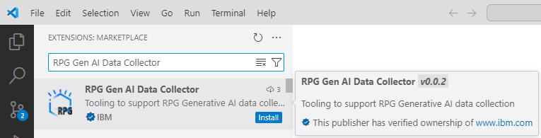
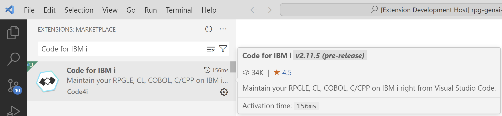
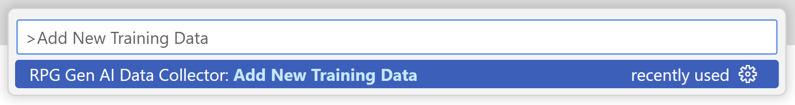
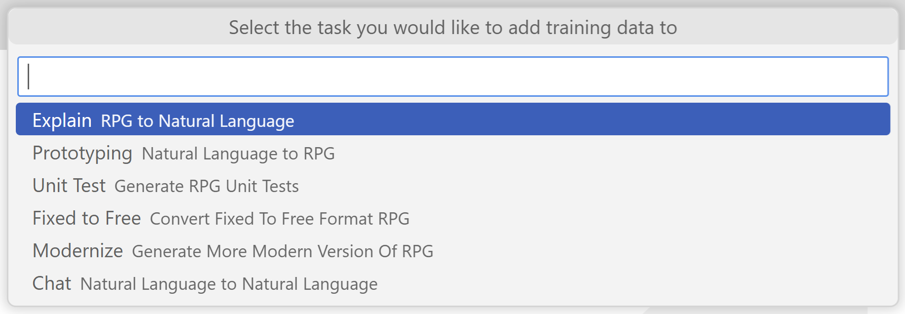
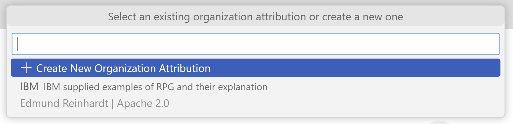
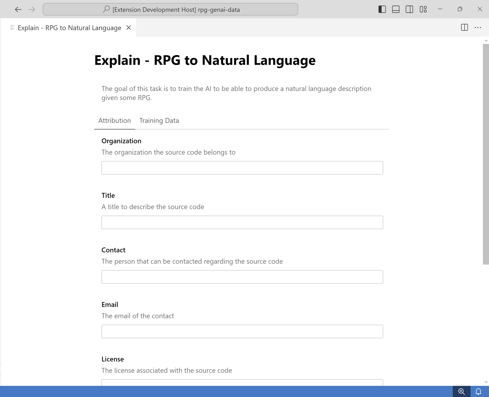
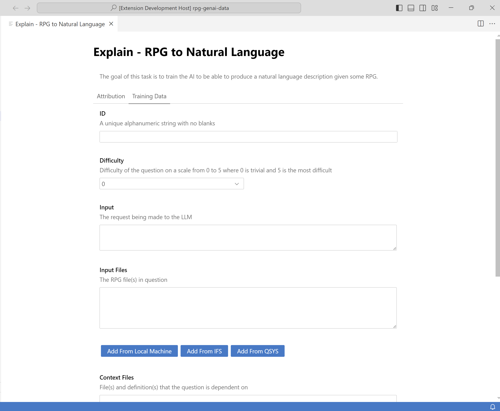
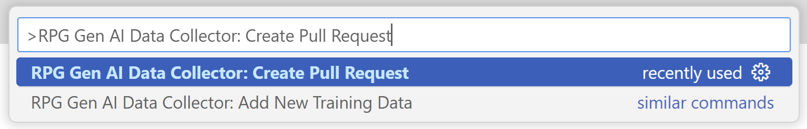

# RPG Gen AI Data Collector

The [RPG Gen AI Data Collector](https://marketplace.visualstudio.com/items?itemName=IBM.rpg-genai-data-collector) VS Code extension is to assist with collecting RPG training data and publishing it to the [rpg-genai-data](https://github.com/AIforIBMi/rpg-genai-data) repository. Rather than having to manually add your data files in the correct format and directory structure, you can use this extension to help you do this by following a series of steps outlined below.

## Installation

1. **Visual Studio Code**: Since this extension is built on top of Visual Studio Code, you will need to first download it from [here](https://code.visualstudio.com/download).

2. **RPG Gen AI Data Collector Extension:** Once you have VS Code installed, navigate to the **Extensions** view and install the [RPG Gen AI Data Collector](https://marketplace.visualstudio.com/items?itemName=IBM.rpg-genai-data-collector) extension. If you cannot access the marketplace, the extension can also be downloaded from the [Open VSX Registry](https://open-vsx.org/extension/IBM/rpg-genai-data-collector) and manually installed using the **Extensions: Install from VSIX...** command in the VS commnad pallete.

    

3. **Code for IBM i**: The RPG Gen AI Data Collector extension has a dependency on the Code for IBM i extension to support adding trianing data from the IFS or QSYS. To install this extension, navigate to the **Extensions** view and install the [Code for IBM i](https://marketplace.visualstudio.com/items?itemName=HalcyonTechLtd.code-for-ibmi) extension. If you cannot access the marketplace, the extension can again also be downloaded from the [Open VSX Registry](https://open-vsx.org/extension/halcyontechltd/code-for-ibmi) and manually installed using the **Extensions: Install from VSIX...** command in the VS commnad pallete.

    

## Add New Training Data

1. Create a fork of the [rpg-genai-data](https://github.com/AIforIBMi/rpg-genai-data) repository. Refer to the instructions [here](https://docs.github.com/en/pull-requests/collaborating-with-pull-requests/working-with-forks/fork-a-repo#forking-a-repository) for more details. 

2. Run the **Git: Clone** command in the VS Code command pallete to clone the forked repository and open it in the workspace.

3. Run the **RPG Gen AI Data Collector: Add New Training Data** command in the VS Code command pallete.

    

4. Select the task you would like to add training data to.

    

5. Select an existing organization attribute or create a new one.

    

6. Fill in the fields in the **Attribution** tab with your relevant information.

    

7. Click on the **Training Data** tab to now add the training data. When adding input, context, or output files, you will have the option to add files
from your local machine, from the IFS, and from QSYS. This will require connecting to an IBM i which can be done by following the instructions [here](https://codefori.github.io/docs/login/).

    

## Create Pull Request

1. Run the **RPG Gen AI Data Collector: Create Pull Request** command in the VS Code command pallete to start the process of creating a pull request. This will stage all changed files, commit/sign your changes, and push them to your forked repository.

    

2. If this process is successful, it will then launch a webpage in your browser to create the pull request on GitHub in the [rpg-genai-data](https://github.com/AIforIBMi/rpg-genai-data) repository. Note that the title will already be prefilled with the task and organization based on the changed files.

3. Review the changed files and click the **Create pull request** button on the GitHub webpage.